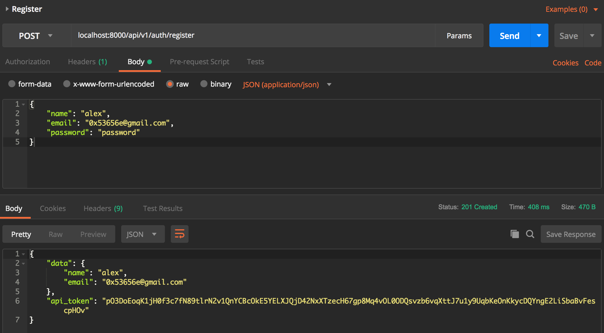
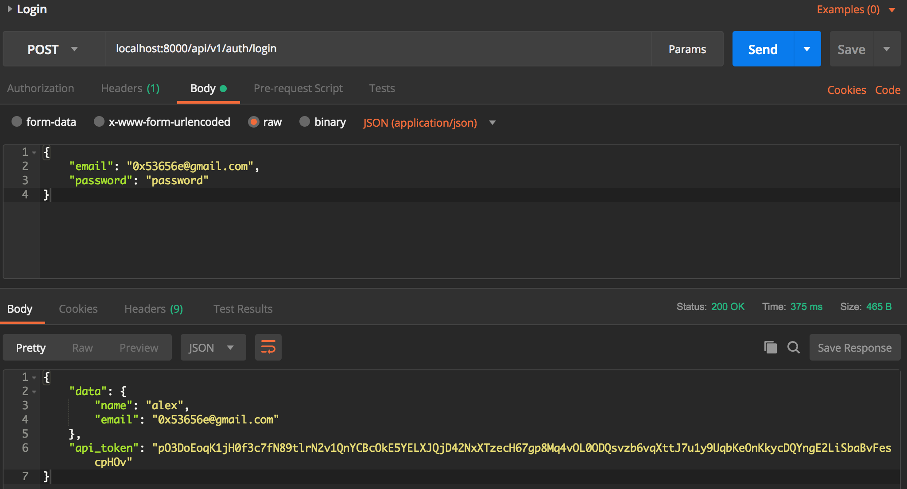

# Authentication

## Create Auth Controller

```bash
$ php artisan make:controller AuthController
```

## Create User Service

Create a class in [app/Http/Services/UserService.php](../app/Http/Services/UserService.php) for helping in
`AuthController` and `UserController`.

```php
<?php

namespace App\Http\Services;

class UserService
{
    //
}

```

## Create User

Add create user function in [app/Http/Services/UserService.php](../app/Http/Services/UserService.php)

```php
<?php

namespace App\Http\Services;

use App\Models\User;

class UserService
{
    /**
     * Create an user of given attributes and return it.
     *
     * @param string $name
     * @param string $email
     * @param string $password
     * @return User
     */
    public function create(string $name, string $email, string $password): User
    {
        /* create an user and return it */
        return User::create([
            'name' => $name,
            'email' => $email,
            'password' => bcrypt($password),
            'api_token' => str_random(User::API_TOKEN_LENGTH)
        ]);
    }
}

```

## Create Request

```bash
$ php artisan make:request CreateUserRequest
```

Move the newly created file at `app/Http/Requests/CreateUserRequest.php` to [app/Http/Requests/Users/CreateUserRequest.php](../app/Http/Requests/Users/CreateUserRequest.php)

Update [app/Http/Requests/Users/CreateUserRequest.php](../app/Http/Requests/Users/CreateUserRequest.php)

```php
<?php

namespace App\Http\Requests\Users;

use Illuminate\Contracts\Validation\Validator;
use Illuminate\Foundation\Http\FormRequest;
use Illuminate\Http\Exceptions\HttpResponseException;
use Illuminate\Http\Response;

/**
 * Class CreateUserRequest
 * @package App\Http\Requests\Users
 * @property string $name
 * @property string $email
 * @property string $password
 */
class CreateUserRequest extends FormRequest
{
    /**
     * Determine if the user is authorized to make this request.
     *
     * @return bool
     */
    public function authorize()
    {
        return true;
    }

    /**
     * Get the validation rules that apply to the request.
     *
     * @return array
     */
    public function rules()
    {
        return [
            'name' => 'required|alpha_num',
            'email' => 'required|email|unique:users',
            'password' => 'required|min:8'
        ];
    }

    /**
     * Get the error messages for the defined validation rules.
     *
     * @return array
     */
    public function messages()
    {
        return [
            /* name */
            'name.required' => 'The :attribute field is required.',
            'name.alpha_num' => 'The :attribute can only be alphabets and numbers.',

            /* email */
            'email.required' => 'The :attribute field is required.',
            'email.email' => 'The :attribute should be an valid email.',
            'email.unique' => 'The :attribute is already been taken.',

            /* password */
            'password.required' => 'The :attribute field is required.',
            'password.min' => 'The :attribute should be longer or equal to :min.'
        ];
    }

    /**
     * Handle a failed validation attempt.
     *
     * @param  \Illuminate\Contracts\Validation\Validator  $validator
     * @return void
     */
    protected function failedValidation(Validator $validator)
    {
        throw new HttpResponseException(response()->json([
            'error' => $validator->errors()
        ], Response::HTTP_BAD_REQUEST));
    }
}

```

## User API Resource

```bash
$ php artisan make:resource User
```

Edit [app/Http/Resources/User.php](../app/Http/Resources/User.php)

```php
<?php

namespace App\Http\Resources;

use Illuminate\Http\Resources\Json\JsonResource;

/**
 * Class User
 * @package App\Http\Resources
 * @property string $name
 * @property string $email
 */
class User extends JsonResource
{
    /**
     * Transform the resource into an array.
     *
     * @param  \Illuminate\Http\Request  $request
     * @return array
     */
    public function toArray($request)
    {
        return [
            'name' => $this->name,
            'email' => $this->email
        ];
    }
}

```

## Register

Add register function in [app/Http/Controllers/AuthController.php](../app/Http/Controllers/AuthController.php)

```php
<?php

namespace App\Http\Controllers;

use App\Http\Requests\Users\CreateUserRequest;
use App\Http\Services\UserService;
use App\Http\Resources\User as UserResource;
use Illuminate\Http\JsonResponse;

class AuthController extends Controller
{
    /** @var UserService $userService */
    private $userService;

    /**
     * AuthController constructor.
     * @param UserService $userService
     */
    public function __construct(UserService $userService)
    {
        $this->userService = $userService;
    }

    /**
     * Register a user.
     *
     * @param CreateUserRequest $request
     * @return JsonResponse
     */
    public function register(CreateUserRequest $request): JsonResponse
    {
        /* create a new user */
        $user = $this->userService->create(
            $request->name,
            $request->email,
            $request->password
        );

        /* response */
        return UserResource::make($user)->additional([
            'api_token' => $user->api_token
        ])->response();
    }
}

```

Add register function in [routes/api.php](../routes/api.php)

```php
<?php

/* ... */

/* version 1 */
Route::group(['prefix' => 'v1'], function () {
    /* auth */
    Route::group(['prefix' => 'auth'], function () {
        Route::post('register', 'AuthController@register');
    });

    /* ... */

});

```

## Login Request

Add user login request by

```bash
$ php artisan make:request UserLoginRequest
```

Move the request just created to [app/Http/Requests/Users/UserLoginRequest.php](../app/Http/Requests/Users/UserLoginRequest.php)
and update it

```php
<?php

namespace App\Http\Requests\Users;

use Illuminate\Contracts\Validation\Validator;
use Illuminate\Foundation\Http\FormRequest;
use Illuminate\Http\Exceptions\HttpResponseException;
use Illuminate\Http\Response;

/**
 * Class UserLoginRequest
 * @package App\Http\Requests\Users
 * @property string $email
 * @property string $password
 */
class UserLoginRequest extends FormRequest
{
    /**
     * Determine if the user is authorized to make this request.
     *
     * @return bool
     */
    public function authorize()
    {
        return true;
    }

    /**
     * Get the validation rules that apply to the request.
     *
     * @return array
     */
    public function rules()
    {
        return [
            'email' => 'required|email|exists:users',
            'password' => 'required'
        ];
    }

    /**
     * Get the error messages for the defined validation rules.
     *
     * @return array
     */
    public function messages()
    {
        return [
            /* email */
            'email.required' => 'The :attribute field is required.',
            'email.email' => 'The :attribute should be an valid email.',
            'email.exists' => 'The :attribute has not been registered yet.',

            /* password */
            'password.required' => 'The :attribute field is required.'
        ];
    }

    /**
     * Handle a failed validation attempt.
     *
     * @param  \Illuminate\Contracts\Validation\Validator  $validator
     * @return void
     */
    protected function failedValidation(Validator $validator)
    {
        throw new HttpResponseException(response()->json([
            'error' => $validator->errors()
        ], Response::HTTP_BAD_REQUEST));
    }
}

```

## Fix Other User Model Issue

[config/services.php](../config/services.php)

```php
<?php

return [

/* ... */

    'stripe' => [
        'model' => App\Models\User::class, /* change here */
        'key' => env('STRIPE_KEY'),
        'secret' => env('STRIPE_SECRET'),
    ],

];

```

[config/auth.php](../config/auth.php)

```php
<?php

return [

/* ... */

    'providers' => [
        'users' => [
            'driver' => 'eloquent',
            'model' => App\Models\User::class, /* change here */
        ],

        // 'users' => [
        //     'driver' => 'database',
        //     'table' => 'users',
        // ],
    ],

/* ... */

];

```

Change the rest docblock reference by searching `App\User` and changing all the results to `App\Models\User`.

## Login

Add login function to [app/Http/Controllers/AuthController.php](../app/Http/Controllers/AuthController.php)

```php
<?php

namespace App\Http\Controllers;

use App\Http\Requests\Users\CreateUserRequest;
use App\Http\Requests\Users\UserLoginRequest;
use App\Http\Services\UserService;
use App\Http\Resources\User as UserResource;
use Illuminate\Http\JsonResponse;
use Illuminate\Support\Facades\Auth;
use Illuminate\Http\Response;

class AuthController extends Controller
{

    /* ... */

    /**
     * Login a user.
     *
     * @param UserLoginRequest $request
     * @return JsonResponse
     */
    public function login(UserLoginRequest $request): JsonResponse
    {
        /* response bad request if the given credentials are wrong */
        if (!Auth::attempt(['email' => $request->email, 'password' => $request->password])) {
            return response()->json([
                'error' => [
                    'password' => 'Wrong credentials are given.'
                ]
            ], Response::HTTP_BAD_REQUEST);
        }

        /* get the logged in user */
        $user = Auth::user();

        /* response */
        return UserResource::make($user)->additional([
            'api_token' => $user->api_token
        ])->response();
    }
}

```

Add the login function to [routes/api.php](../routes/api.php)

```php
<?php

use Illuminate\Http\Request;

/* ... */

/* version 1 */
Route::group(['prefix' => 'v1'], function () {
    /* auth */
    Route::group(['prefix' => 'auth'], function () {
        Route::post('register', 'AuthController@register');
        Route::post('login', 'AuthController@login');
    });

    /* ... */

});

```

## Testing

Test the register and login function using [Postman](https://www.getpostman.com/)

### Register



### Login



## Next Step

[6. user controller](6.%20user%20controller.md)
